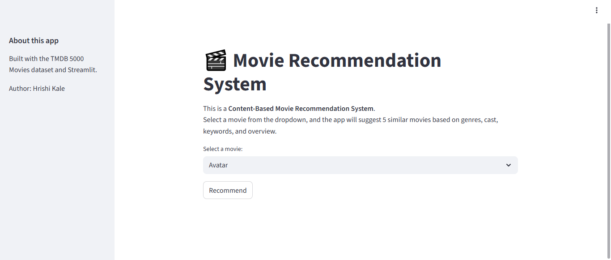
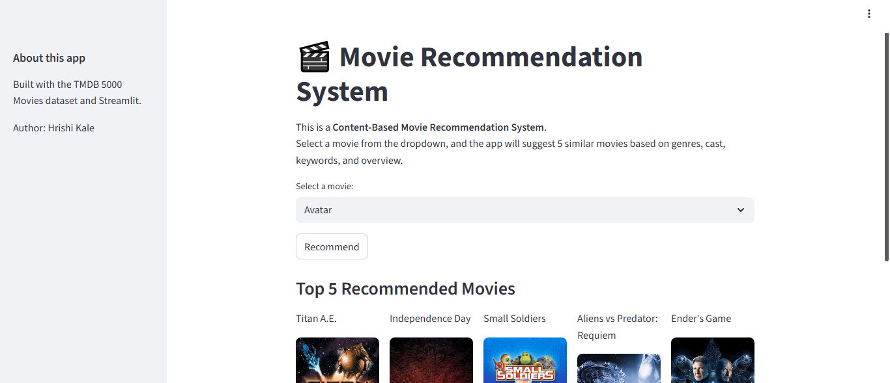
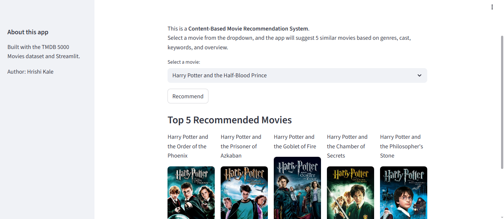

# 🎬 Movie Recommendation System

A **Content-Based Movie Recommendation System** built using **Python, Streamlit, and TMDB API**.  
This app suggests similar movies based on genres, cast, keywords, and overview.  

## Dataset
This project uses the **TMDB 5000 Movies Dataset**, available on [Kaggle](https://www.kaggle.com/datasets/tmdb/tmdb-movie-metadata).

##  Live Demo
Try out the app here: [https://movie-recommendations-mqss.onrender.com/](https://movie-recommendations-mqss.onrender.com/)

##  Features
- Select a movie and get **Top 5 Recommendations**  
- Movie posters fetched dynamically from **TMDB API**  
- Clean and interactive **Streamlit UI**  
- Data preprocessed and stored in **pickle files**  

##  Project Structure
- `app.py` → Main Streamlit app  
- `movies.pkl` → Preprocessed movie data  
- `similarity.pkl` → Cosine similarity matrix  
- `requirements.txt` → Required dependencies

## **Dataset**
The model is built on the TMDB 5000 Movie Dataset available on Kaggle.

**Screenshots**

